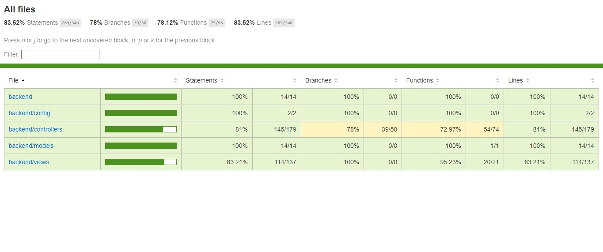

# Tecnologías utilizadas en el proyecto:
<div align=center>
    <a href="https://github.com/luigiMinardi/redsocial_backend/blob/884980cce6398b32e8976d5da082224e5edd8942/LICENSE">
        
    </a>
    
    
    
     
</div>

------------------------------------------------------
Haga clic [aquí](https://github.com/luigiMinardi/redsocial_backend.git) para ver el repositorio de este proyecto.

-------------------
# Resumen general del proyecto:

## Introducción.

- Este proyecto para GeeksHubsAcademy es un backend totalmente funcional que se utilizará para almacenar los datos de los usuarios de una red social. Los puntos finales se dividen en dos categorías: 'hilos' y 'usuarios'. La api y la base de datos fueron creadas con mongodb y mongoose en nodejs. <br>
  

--------------------------------------------

## Características.

- En este proyecto hemos creado un BackEnd completo para utilizarlo en nuestra web de la red social. Contiene las siguientes características
  

- una API REST para la gestión del CRUD de los EndPoints , dividida en las 'vistas' de 'usuarios' y 'hilos'
  
- Base de datos MongoDB no relacional para mantener los datos


---------------------------------------
## Como Usar.

este proyecto está desplegado en heroku en el siguiente enlace: https://backend-red-social-geeks.herokuapp.com/

El objetivo de este proyecto es enlazar con el cliente front-end de nuestro proyecto de red social. Los puntos finales de la api se contactan desde el front end que se despliega aquí https://master.dsjje3enz9xk4.amplifyapp.com/

-----------------------------------

### EndPoints de Hilos :

- Endpoint de crear un Hilo :
  
  ```bash
  router.post("/",HiloController.crearHilo(body));
  ```

- Endpoint de mostrar Todos los Hilos : 
  
  ```bash
  router.get("/", HiloController.traerHilos());
  ```

  - Endpoint de mostrar un Hilo por ID : 
  
  ```bash
  router.get("/:id", HiloController.traerHiloId(id));
  ```

  - Endpoint de mostrar los likes de un Hilo por ID : 
  
  ```bash
  router.get('/:id/likes', HiloController.getLikesDeHilo(id));
  ```

  - Endpoint de Modificar el Hilo por ID. : 
  
  ```bash
  router.patch("/:id", HiloController.cambiaHilo(id, body));
  ```

  - Endpoint de borrar un Hilo por ID. : 
  
  ```bash
  router.delete("/:id",  HiloController.borrarHilo(id));
  ```

<br>

-----------------------------------------------


### EndPoints de Usuarios :

- Endpoint de crear un Usuario:
  
  ```bash
  router.post('/',  UsuarioController.crearUsuario(body));
  ```
  
- Endpoint de Login de Usuario:

  ```bash
  router.post("/login", UsuarioController.loginUsuario(body));
  ```

- Endpoint de Seguir a un Usuario. :
    ```bash
    router.post("/:id/siguiendo", UsuarioController.seguirUsuario(id, body));
    ```
- Endpoint de Dar un Like a un Hilo. :
    ```bash
    router.post("/:id/like/:pk", UsuarioController.postGustaDeUnHilo(usuarioId, hiloId));
    ```
- Endpoint de mostrar Todos los Usuarios.:
  
    ```bash
    router.get("/",  UsuarioController.traerUsuarios());
    ```

- Endpoint de mostrar los Usuarios que sigues: 

    ```bash
    router.get("/:id/siguiendo",  UsuarioController.traerUsuariosQueSigues(id));
    ```

- Endpoint de motrar los Usuarios que te siguen:

    ```bash
    router.get("/:id/seguidores", UsuarioController.traerUsuariosQueTeSiguen(id))
    ```

- Endpoint de mostrar publicaciones de un Usuario: 

    ```bash
   router.get('/:id/publicaciones',  UsuarioController.traePublicacionesQueTiene(id))
    ```

- Endpoint de mostrar un Usuario por ID: 

    ```bash
    router.get("/:id",UsuarioController.traerUsuarioId(id))
    ```

- Endpoint de buscar un Usuario por nombre, apellido o correo.: 

    ```bash
    router.get("/busqueda", UsuarioController.buscarUsuario(busqueda))
    ```

- Endpoint de buscar los likes de un Usuario.ID :

    ```bash
    router.get('/:id/likes', UsuarioController.getLikesDelUsuario(id))
    ```

- Endpoint de Modificar el perfil por ID:

    ```bash
    router.patch("/:id", UsuarioController.cambiaUsuario(id, body))
    ```

- Endpoint de Modificar la contraseña por ID:

    ```bash
    router.patch("/:id/cambiar-clave", UsuarioController.cambiaClaveUsuario(id, body))


- Endpoint de borrar un Usuario por ID:

    ```bash
    router.delete("/:id",  UsuarioController.borrarUsuario(id))

- Endpoint de dejar de seguir a un Usuario:

    ```bash
    router.delete("/:id/siguiendo/:pk", await UsuarioController.dejarDeSeguirUsuario(id, pk))

- Endpoint de quitar el like de un hilo:

    ```bash
    router.delete("/:id/like/:pk", UsuarioController.deleteLikeDeUnHilo(usuario, hilo))


--------------------------------

## cobertura de tests de los endpoints:




------------------------------------------------


por Luigi Minardi, Roberto Guzmán y Callum Gordon


---------------------
## Repositorio del Backend: (https://github.com/luigiMinardi/redsocial_backend.git)<br>

